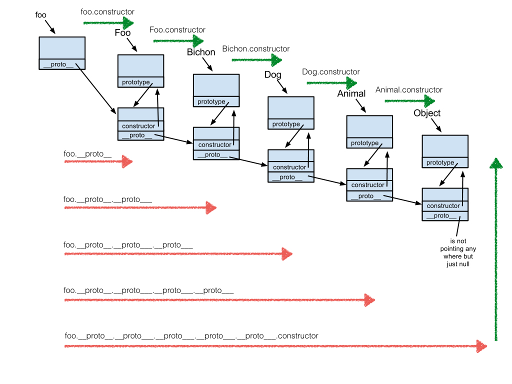
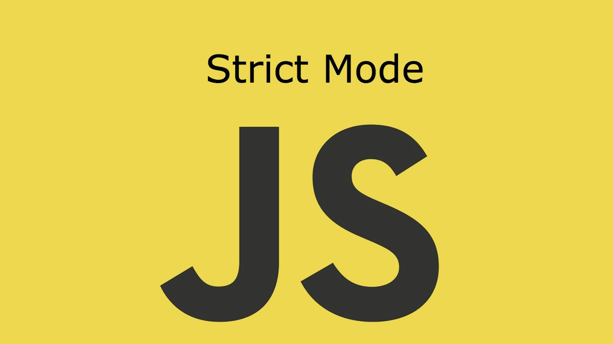

###### 이롭게 에이전시 교육

[← 레퍼런스로 돌아가기](js-00-reference.md)

### Javascript 함수는 일급객체

Javascript 함수는 **일반 함수**로서 때론 **생성자 함수**, **함수의 인자**, **함수의 반환 값**, **객체의 멤버**, **배열의 원소**로서 다양하게 사용된다.

#### 일급객체(First-Class Object)의 특징

- 변수, 데이터 구조 안에 담을 수 있다.
- 인자(Parameter, Argument)로 전달할 수 있다.
- 반환 값(Return Value)으로 사용할 수 있다.
- 런타임(실행) 중에 생성할 수 있다.
- 할당에 사용된 이름과 관계 없이 고유하게 식별할 수 있다.

```js
// 변수에 함수를 할당할 수 있다.
var fn = function () { ... };

fn();

// 함수의 인자로 함수가 전달될 수 있다.
function fn(callback) {
	callback();
}

fn( function() { ... } );

// 함수의 반환 값으로 함수를 내보낼 수 있다. (객체도 가능)
function fn() {
	return function() { ... };
}

fn()();

// 객체의 속성으로 함수를 설정할 수 있다. (메소드)
var obj = {
	"fn": function() { ... }
};

obj.fn();

// 배열의 원소(Item)로 함수를 메모리할 수 있다.
var arr = [];
arr[0] = function() {...};

arr[0]();
```

<!--
	참고해서 읽어볼 자료
	http://www.slideshare.net/moschel/javascript-functions
	http://www.slideshare.net/julyfool/secrets-of-the-javascript-ninja-chapter-3-functions-are-fundamental
-->

<!--  -->


-

### Javascript는 객체 지향 언어

Javascript는 잘 알려진 객체 지향 언어의 Class와는 다른 방법(Prototype)으로 객체 지향을 구현할 수 있다.
(ECMAScript 2015(ES6)에서는 Class를 사용할 수 있다) Javascript가 지원하는 프로토타입(Prototype)은
코드를 재사용하는 방법 중 하나로 객체의 능력을 상속(Inheritance) 할 수 있도록 구현한다.

사용자가 생성한 모든 함수는 prototype 속성(프로퍼티)을 가지는데 이는 프로토타입은 객체(빈 객체)를 참조한다.
프로토타입 객체에 멤버를 추가하면 상속을 통해 생성자를 통해 생성된 객체(인스턴스)는 이를 물려받아 사용가능하다.

<!--  -->


#### Javascript 객체의 종류

- 네이티브 객체
- 호스트(브라우저) 객체
- 사용자 정의 객체

-

### ECMAScript

문서객체모델(DOM, Document Object Model), 브라우저객체모델(BOM, Browser Object Model),
규정 외 호스트(브라우저) 객체를 제외한 코어 자바스크립트 프로그래밍 언어는 ECMAScript(ES) 표준에 기반을 두고 있다.

- ECMAScript 3 - 1999년 승인
- ECMAScript 4 - 개발 중단
- ECMAScript 5 - 2009년 12월 승인
- ECMAScript 5.1 - 2011년 승인
- ECMAScript 6 - 2015년 6월 승인

<!--  -->


#### 엄격 모드

ES5에서 추가된 엄격 모드(Strict Mode)는 기능 추가가 아닌, 오류 발생 가능성이 있는 코드를 제거하는 역할을 한다.
엄격 모드를 지원하는 브라우저에서는 오류 발생 가능성이 있는 코드 작성 시 오류를 발생하지만, 지원하지 않는
구형 브라우저는 이를 단순하게 무시한다. 즉, 호환성에 문제는 없다. (하위 호환성 유지) 엄격 모드는 개별적인
유효범위(함수, 전역 유효범위 등) 내부 첫 라인에 아래와 같은 문자열을 선언하면 된다.

```js
// --------------------------------
// ES5에 추가된 엄격 모드(strict mode)
// --------------------------------
// 전역 (Global Scope)
'use strict';

// 함수 영역(Local Scope)
function fnScope() {
	'use strict';
	// ...
}
```

**ES는 추후 엄격 모드만 지원할 계획**이다. ES5 엄격모드는 이 과정을 위한 과도기 버전인 것이다.

<!--  -->
